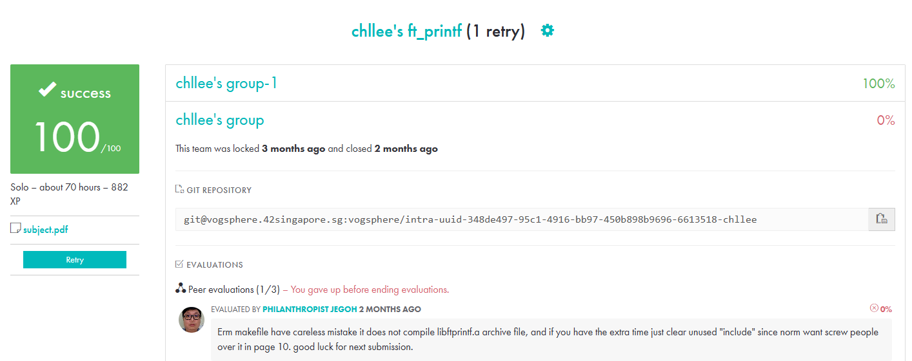

  

# Ft_Printf (Mandatory Only)
An introduction to Variadic Functions, this project requires us to recreate a miniscule version of the standard printf function found in <stdio.h>. This project has a straightforward mandate of recreating a library function, while at the same time introducing a new concept that has not yet been encountered at the beginning of the common core.

The bonus portion of the project asks students to implement various flags that are used in the typical printf function, such as precision, width, etc. 

## Personal Project Challenges 
Being very new to coding and with almost zero background in computer science, understanding how to derive various algorithms in the Piscine was tough. It made me doubt my ability to think logically, but nothing has made me feel like a complete idiot until stumbling upon va(args). 

Not being the fastest learner, or the best in understanding new concepts, it took countless hours of reading and asking peers how the va(list) and va(args) actually worked. However, that was just the start of my nightmare. 

This project tested my logical thinking to a whole new level. When I first began coding the function, I had written what I thought to be a good way to segregate "if-else" conditions. However, it didn't take long for me to realise that I was segmenting code unnecessarily, forcing myself to rewrite logic that could have simply been executed together. 

By the time I had completed the mandatory portion of the project, I realised that the bonus was simply a time consuming endeavour in more if-else statements, and some additional conditional logic. Hence, I decided to move on to the next project and leave the bonus where it was. Aka, in the abyss. 

## Results 
After one failure from accidentally changing a variable name and forgetting to ensure that all instances of the name was updated, I managed to validate the project smoothly and without hiccups. 

  

