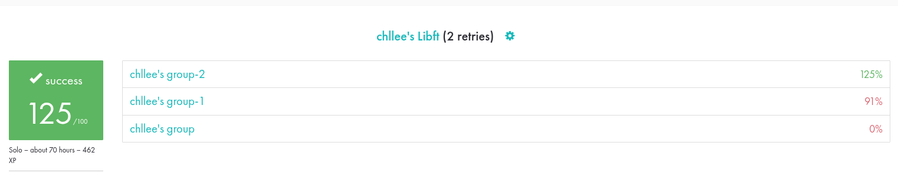

    

# Libft + Bonus (Structs & Linked Lists)
Standard functions help make programming in C less painful and tedious. This Libft project helps students do this by providing a list of commonly used standard functions, and allowing them to use these functions by implementing them from scratch and then compiling them into their own library.

Students are encouraged to further add other useful and commonly used functions to this library throughout their time in the core programme, while keeping the library compliant with future project guidelines. Here are the basics : 

## Part 1 - Standard Functions to Implement
Functions in this part of the project are done in accordance with their respective man pages. Both behavior and return values are built to replicate that of its' standard function equivalent. 

    <ul>
        <li>isalpha</li>
        <li>isdigit</li>
        <li>isalnum</li>
        <li>isascii</li>
        <li>isprint</li>
        <li>strlen</li>
        <li>memset</li>
        <li>bzero</li>
    </ul>
    <ul>
        <li>memcpy</li>
        <li>memmove</li>
        <li>strlcpy</li>
        <li>strlcat</li>
        <li>toupper</li>
        <li>tolower</li>
        <li>strchr</li>
        <li>strrchr</li>
    </ul>
    <ul>
        <li>strncmp</li>
        <li>memchr</li>
        <li>memcmp</li>
        <li>strnstr</li>
        <li>atoi</li>
        <li>calloc</li>
        <li>strdup</li>
    </ul>

### <u>Trickiest Functions & Challenges</u>
**1. memmove**  
A seemingly straightfoward function to replicate, I had to abandon my first project submission due to misreading the man page. 

    The memmove() function copies n bytes from memory area src to memory area dest. 
    The memory areas may overlap: copying takes place as though the bytes in src are first copied into a temporary array that does not overlap src or dest, and the bytes are then copied from the temporary array to dest.

Based on the above description, I had initially created a static buffer to handle the byte movement by simply copying the required bytes into the buffer, and then into the destination to avoid altering the source in any way - Especially in the case where there was a memory overlap between the source and the destination area. 

**2. calloc**  
The second challenge in Part 1 of the project was re-implementing the Calloc function. This was my first exposure to the heaven and hell that is Malloc and Memory Allocation, since I had barely scraped the surface of Malloc during the Piscine. While this function was not difficult to implement, it made me thoroughly understand how Malloc works and why Malloc-guards are a necessity.

## Part 2 - Additional Functions
In Part 2, students are tasked with re-creating standard functions commonly found in high level programming languages like Javascript and Python, but may or may not be found in C. These functions are commonly used in almost every coding project, and serve as a strong basis for understanding how these commonly found operations work under the hood. 

    <ul>
        <li>ft_substr</li>
        <li>ft_strjoin</li>
        <li>ft_strtrim</li>
        <li>ft_split</li>
        <li>ft_itoa</li>
        <li>ft_strmapi</li>
    </ul>
    <ul>
        <li>ft_striteri</li>
        <li>ft_putchar_fd</li>
        <li>ft_putstr_fd</li>
        <li>ft_putendl_fd</li>
        <li>ft_outnbr_fd</li>
    </ul>

### <u>Trickiest Functions & Challenges</u>
**1. ft_split**  
Probably the bane of every 42 student, this is one function that just keeps breaking no matter how much you try. While the general idea of how the function works is simple enough to understand, building it while staying Norminette compliant is one of the first mini-mountains to climb. 

    Allocates memory (using malloc(3)) and returns an array of strings obtained by splitting ’s’ using the character ’c’ as a delimiter. The array must end with a NULL pointer.

The idea of splitting a string by a given delimiter is not a new one, and brings to mind functions like string.split() in languages such as Javascript and Python. 

My biggest challenge when faced with the implementation of this function came in 2 main forms. 

First, I needed to write all functions within 25 lines to be Norminette compliant - including helper functions. This was a simple matter of breaking up logical code into smaller chunks and helper functions, while maintaining a maximum of 5 functions within the file. 

Secondly, and more importantly, ensuring Malloc-guards were in place and that there were no possible memory leaks when using this function. Due to the fact that we had to deal with an array of arrays, this challenge introduced me to the notion that we not only had to free() our strings should Malloc fail, but also the entire outer-array to ensure that there is no chunk of idle memory simply floating around.

**2. _fd functions**  
The file descriptor functions were not so much tricky or challenging. More accurately, they provided an insight into what File Descriptors are and when / how they are used in our standard functions such as the write() function.

## Bonus - Structures and Linked Lists
This section is completed by first creating a given struct prototype in the created header file, then compiling the given functions together with the created library via "make bonus" in the Makefile. 

    <ul>
        <li>ft_lstnew</li>
        <li>ft_lstaddfront</li>
        <li>ft_lstsize</li>
    </ul>
    <ul>
        <li>ft_lstlast</li>
        <li>ft_lstaddback</li>
        <li>ft_lstdelone</li>
    </ul>
    <ul>
        <li>ft_lstclear</li>
        <li>ft_lstiter</li>
        <li>ft_lstmap</li>
    </ul>

### <u>Trickiest Functions & Challenges</u>
Personally, the biggest challenge I faced while doing this Bonus exercise was in wrapping my head around the fact that creating or editing a linked list means having to take into consideration where in the list I am currently at, and how making one small change can completely destroy the existence of the list altogether. 

I'm not ashamed to admit, I had re-did my code numerous times after testing only to find that for some reason my pointer was pointing an invalid address, or that I had not free-ed a certain node in my list, or my list had disappeared into the void simply because I forgot to change the pointer to the new head of the list, or updated the address of the next node in the list.

# Results & Key Takeaways
### <u>Results</u>
After 60+ gruelling days, the Libft project had finally come to an end. What took some maybe a day or a week to complete, took me weeks of continuous debugging and learning, and 3 submissions in total, to wrap up. However, what doesn't kill you makes you stronger, right? I've definitely come out the other end of this project with a much deeper understanding of how functions work, and just how much modern high level languages do for developers under the hood that we barely notice. 

 

    

 

Seeing my first 125/100 in 42 School was definitely a huge encouragement to keep on pushing on. During the Piscine, I was neither the strongest nor fastest programmer among my peers. If anything at all, I was always the one seeking help from others. While my peers were blazing ahead with 125 scores on their Piscine exercises, I was struggling to stay afloat and simply hoping I had done enough for each project to be validated so that I could move on to the next topic. 

As with every retry done during the Piscine, we learn something new about programming, and Libft was no different. At the first submission, I saw how carelessness had led to a quick failure of the project. On my second submission, not only did I learn about NULL-Safe functions, but I also learned about the importance of truly understanding the project requirements and the role I have to play when defending my code implementation. Finally, on my last submission, while it was a near-perfect submission, my evaluators were thorough and meticulous. They scrutinised my code, looking for holes and trying to break my functions with non-standard input. Upon finding any possible weaknesses in my code, not only did they point it out, but they also shared what their approach was when facing similar issues. 

### <u>Key Takeaways</u>
1. You're never too perfect to learn  
    - Even though I managed a perfect score on this project, my code and logic is no where near impeccable. It is important to always stay humble and continue learning and refining what you have learnt, so that this knowledge can one day serve as the sharpest, most trustworthy sword in your arsenal. 

2. If you think it's too easy, you're probably right  
   - Looking back at my submissions, I took a very complacent stance on my first try. I had run my code with manual test cases while writing it, and then through multiple available testers that all passed. After seeing a sea of green that sparked immense joy, I gleefully clicked on the "Submit" button, only to realise that testers do not test everything and that my code was flawed. 

3. Mem Allocation & Mem Leaks are the bane of my existence  
    - While I'm sure that I will grow to exist more comfortably with the monster that is memory allocation, this project definitely tested my patience and willpower with it. It seems that the sage advice of not using Malloc unless absolutely necessary is something that I should constantly keep in mind to prevent unnecessary trouble and pitfalls. 

 
All in all, the Libft project was not only tedious and painful to complete, but also thoroughly tested our ability to focus and think clearly while learning new concepts amidst a hailstorm of Norme errors. 

 
Till the next project, Oui! 